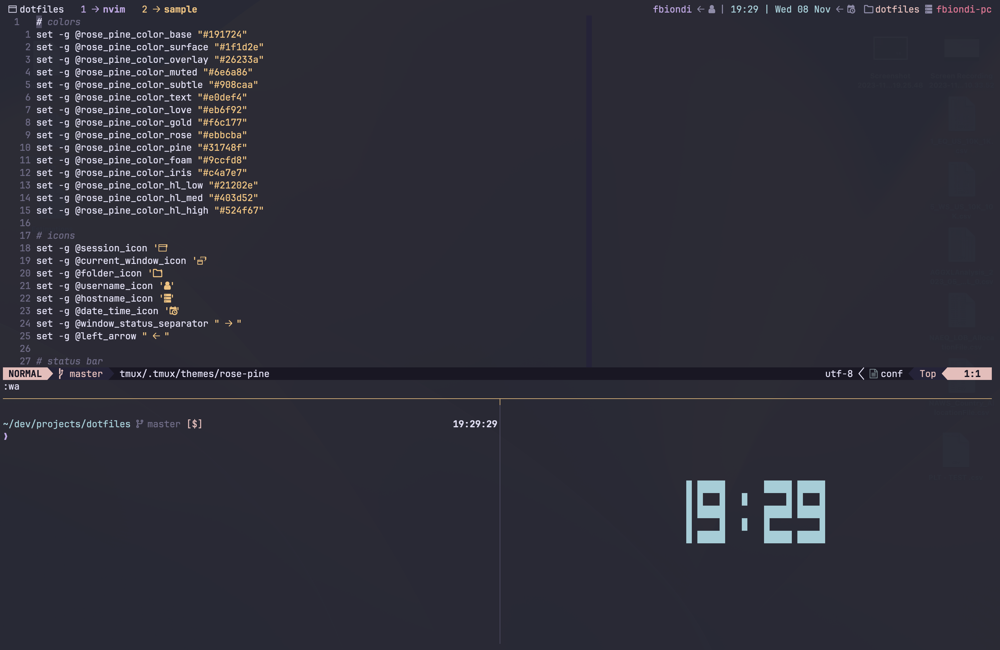

# tmux-snazzy

> A [tmux](https://github.com/tmux/tmux/wiki) theme with rose-pine color palette. Based on [rose-pine](https://github.com/rose-pine/tmux/) by [lluchkaa](https://github.com/lluchkaa).



## Install

Download this file and place it alongside your tmux config file.

```
$ curl -o ~/tmux-rose-pine.theme.conf https://raw.githubusercontent.com/fdbiondi/tmux-rose-pine-theme/master/tmux-rose-pine.theme.conf
```

Place this line at the bottom of your `.tmux.conf` file:

```
source-file ~/tmux-rose-pine.theme.conf
```

## License

[](https://opensource.org/licenses/MIT)

## Colors Palette

base #191724
silver #e0def4
grey #908caa
red #eb6f92
green #31748f
yellow #f6c177
blue #9ccfd8
magenta #c4a7e7
rose #ebbcba

my background
#282a36
